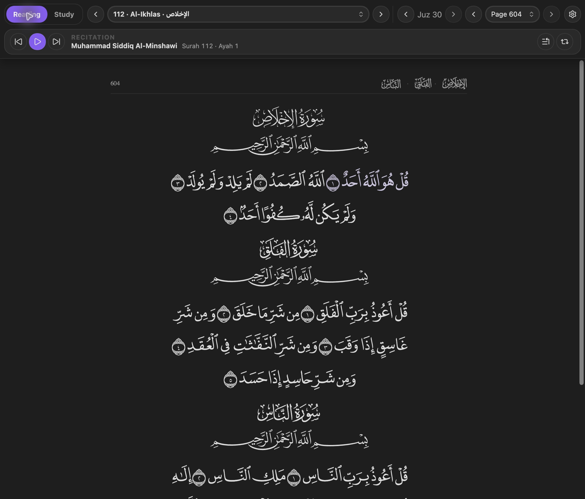
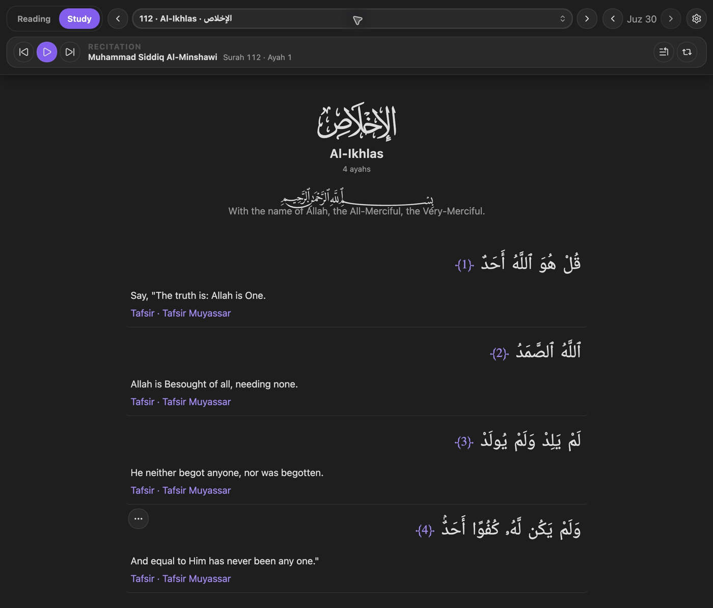
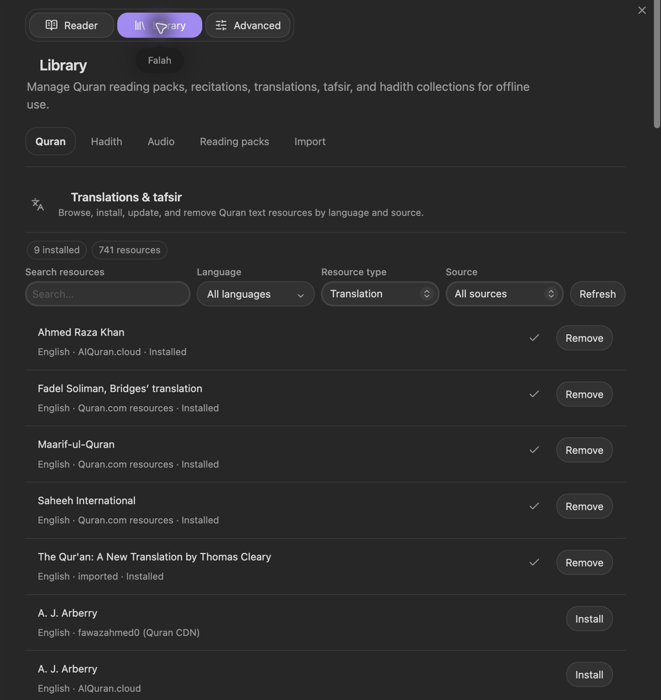
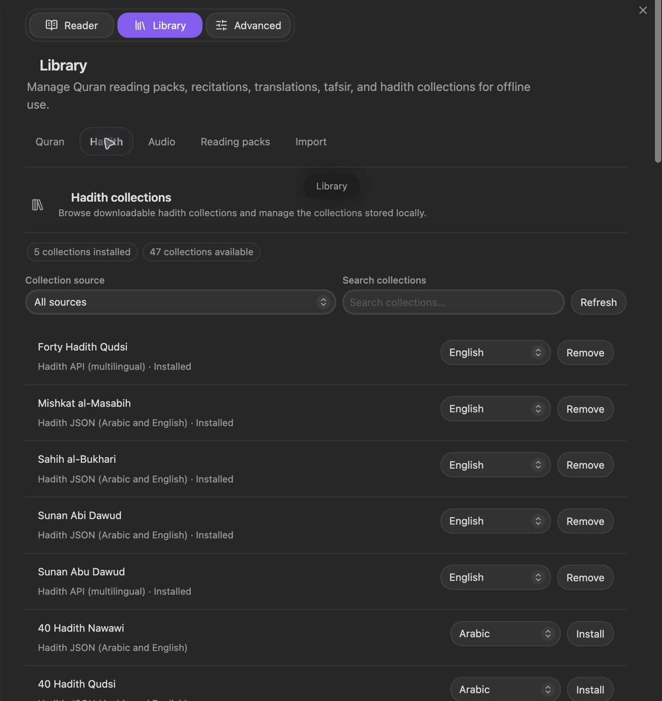
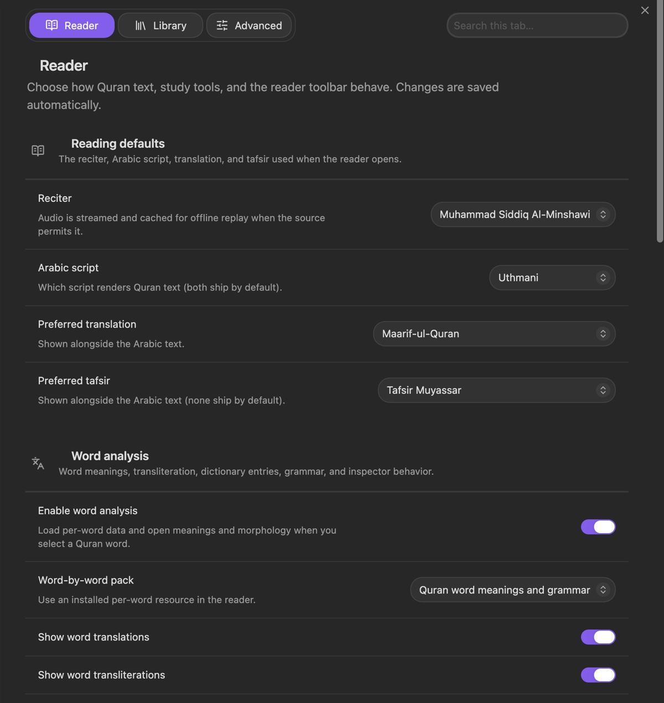

# Falah

Quran and Hadith references, native to your Markdown notes. Clickable `falah://` links, a full Quran reader, slash-command lookup, and honorific glyphs — offline-first, desktop and mobile.

[Download the latest release](https://github.com/zubayrali/obsidian-falah/releases/latest) · [What's new in 0.3.0](docs/releases/0.3.0.md)

## Screenshots

Actual desktop screenshots from Obsidian with the Lumin theme. Colors and controls follow your active theme.

### Quran reading and study

Read the Madinah Mushaf in Reading mode, or switch to Study mode for translations, tafsir, and recitation.





### One library for installed and available resources

Browse Quran translations and tafsir together, filter by source and type, and search for a language.



Choose a language for each hadith collection and install it for offline use.



### Clear settings

Reader, Library, and Advanced tabs keep related settings together, without nested accordions.



## What it does

- **`falah://` references.** Cite a verse or hadith anywhere in your vault (`falah://quran/2/255`, `falah://hadith/bukhari/1`) and it renders as a clickable chip. Click it to open the reference in a detail view, with a jump into the full reader from there. You rarely write these by hand — `/quran` and `/hadith` generate them for you.
- **Reading and Study modes.** Reading mode presents the 604-page Madinah Mushaf in QCF4 with minimal chrome; Study mode keeps translations, tafsir, word meanings and grammar, comparison, and recitation close at hand. Switching modes preserves the current ayah, and the reader can be popped into its own window.
- **Slash-command lookup.** Type `/quran` or `/hadith` mid-sentence to search and insert a reference without leaving your note. `/` also completes honorific glyphs (ﷺ, ﷻ, رضي الله عنه, and others) by typing their transliteration.
- **Commands** for opening/popping out the reader, inserting a verse or hadith reference, inserting an honorific, opening the full detail view for the reference under your cursor, copying a reference as plain text, and refreshing a reference's cached text.
- **Offline-first.** Core Quran text ships bundled with the plugin. Additional translations, tafsirs, word analysis, QCF4 Mushaf pages/fonts, and hadith collections install or cache on demand — no network needed once installed.
- **Find and navigate.** Jump by surah, ayah, juz, hizb, rub, page, or sajdah; browse Quran boundaries; or search bundled and installed text entirely offline.
- **Companion API.** Other plugins can hook into Falah's reader and reference system (verse actions, ayah-row decorators, slash-menu entries) via a small public API — see [Tadabbur](https://github.com/zubayrali/obsidian-tadabbur) for reflection/journaling built entirely on it.

References Falah writes into notes are plain Markdown (`falah://` links and `> [!quran]` callouts). Supporting bookmarks and reading progress use documented JSON files inside your vault; nothing is stored outside it.

## Install

Until this is in the community plugin store:

1. Download `main.js`, `manifest.json`, and `styles.css` from the [latest release](https://github.com/zubayrali/obsidian-falah/releases/latest), or extract them from the `falah-0.3.0.zip` archive.
2. Put them in `<vault>/.obsidian/plugins/falah/`.
3. Reload Obsidian and enable **Falah** in Community Plugins.

## Settings

- **Reader** — choose the reciter, Arabic script, preferred translation/tafsir, Quran fonts, word analysis, reading appearance, and toolbar controls. Bundled and vault fonts are always available; desktop users can explicitly grant access to the system font list.
- **Library** — install and manage the Mushaf, word analysis, recitations, translations, tafsir, and hadith collections. Search and filter the catalogues, resume downloads, and scan manually supplied resource packs.
- **Advanced** — configure reading progress and bookmarks, optional online-fallback editions, storage paths, and cache maintenance.

## Data sources and privacy

Falah does not send vault contents, filenames, notes, bookmarks, or reading progress to any service. Network access only happens for a feature the user invokes, such as installing a resource, streaming audio, or using the optional online fallback.

Quran translation downloads include [Quran Project](https://github.com/The-Quran-Project/Quran-API), which serves Quran.com-derived English, Bengali, and Urdu chapter files at `quranapi.pages.dev`. Select **Quran Project** in **Settings → Falah → Library → Quran** to install a language for offline reading.

Hadith downloads also include [Hadith Unlocked](https://hadithunlocked.com), with Arabic and English collections, narration chains, and provider-supplied grading. Its installed data preserves exact identifiers such as `muslim:8a`. Online hadith lookup tries the existing hadith CDN first and contacts Hadith Unlocked if that request fails or the CDN cannot represent the exact identifier. These requests send only the selected collection and hadith number. No API key is required. Installed collections and bundled Nawawi are consulted before either online service. Collection numbering differs across datasets; Falah preserves supplied identifiers rather than removing letter suffixes.

The library reports missing ayah text found during new or resumed translation/tafsir downloads. Quran.com tafsir downloads recover omitted grouped passages through the same resource's verse endpoint. Remaining upstream gaps are shown in the library. Previously installed resources gain coverage measurements when downloaded again; older Quran.com tafsirs offer **Update** after their catalog loads.

The source adapters and exact-reference approach were informed by [AfzGit's Quran and Hadith Fetcher](https://github.com/AfzGit/Obsidian-Quran-Hadith-Fetcher). Falah handles Hadith Unlocked's nested offline export format separately from its live lookup format.

The optional **Word meanings and grammar** pack combines word text, transliteration, and contextual English meanings from the [Quran.com API](https://api.quran.com) with morphology from the [Quranic Arabic Corpus](https://corpus.quran.com) (version 0.4, GPL). Installation downloads those public datasets and stores the normalized result inside the plugin's local data folder. Opening a word after installation is entirely offline.

Reading mode downloads its page data and required fonts directly from [quran-qcf4](https://github.com/MohamadHajjRabee/quran-qcf4) when the user enters it, then caches them in the plugin folder. A complete offline pack can be downloaded explicitly from **Settings → Falah → Library**. QCF4 is the Hafs Madinah Mushaf 1441 AH: calligraphy by Uthman Taha, produced by the King Fahd Quran Complex, with the web font version prepared by Ahmad ElGharib. The page database is MIT licensed; the Quran Complex fonts retain their own attribution and terms and are not bundled in this repository.

Arabic chapter headings use [QUL Surah Name Fonts v4](https://qul.tarteel.ai/resources/font/457), bundled for offline use under the MIT License. Copyright © 2024-present Tarteel, Inc.

## Development

```bash
npm install
npm run dev    # watch build
npm test       # vitest
npm run test:integration # rendered reader interaction smoke test
npm run test:apis # live public resource API smoke tests
npm run test:apis:all # every catalog resource, complete hadith collections, audio/word/Mushaf probes
npm run lint   # eslint (obsidianmd community-review rules)
npm run build  # typecheck + production bundle
```

Falah exposes a versioned public API (`FALAH_API_VERSION`, currently 7) for companion plugins — see `src/api.ts`. Falah itself depends on no other plugin.

## License

MIT
